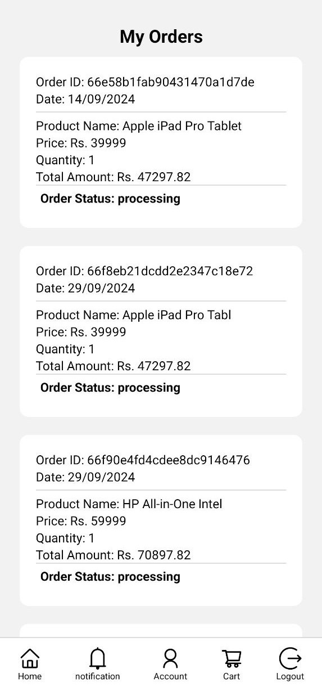

# 🛒 SnapKart

**SnapKart** is an e-commerce application designed to deliver a simple yet delightful online shopping experience. Built with modern technologies, it offers a smooth and responsive interface for both Android and iOS users, making shopping effortless and enjoyable.

---

## ✨ Features

- **Cross-Platform Compatibility**: Developed with React Native for seamless performance on Android and iOS.
- **State Management**: Integrated Redux to ensure consistent data flow and a stable user experience.
- **Scalable Backend**: Powered by Express.js and Node.js for efficient server-side operations and API management.
- **Flexible Data Storage**: Utilized MongoDB for a dynamic NoSQL database structure, ideal for managing user data, products, and orders.
- **Secure Payments**: Implemented Stripe for reliable and secure transaction processing, giving users peace of mind during checkout.

---

## 🛠️ Tech Stack

- **Frontend**: React Native
- **State Management**: Redux
- **Backend**: Express.js & Node.js
- **Database**: MongoDB
- **Payments**: Stripe

---

## 📸 Screenshots

### Login, Register, and Home Screen
  

### Product Section, Product Details, and Notifications
  

### Cart, Payment Method, and Order Details
  

### Stripe Integration

## 🎯 Project Highlights

- **User-Focused Design**: Prioritized an intuitive and engaging user interface to enhance the shopping experience.
- **Secure Transactions**: Incorporated Stripe to handle payments with industry-standard security protocols.
- **Scalable Architecture**: Built with a tech stack that supports growth and future enhancements.

---

## 🙌 Contributing

Contributions are welcome! If you'd like to contribute, feel free to fork the repository, create a branch, and submit a pull request. Suggestions and issues can also be discussed through GitHub.
